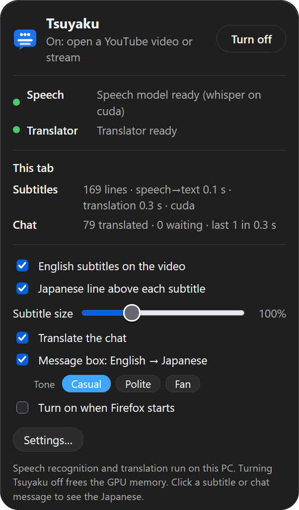
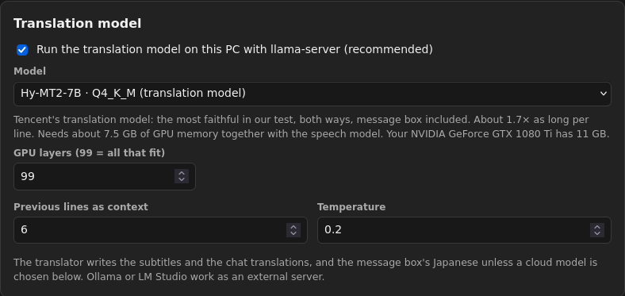

# Tsuyaku 通訳

**Live Japanese → English for YouTube, in Firefox, on your own PC.**

[](https://github.com/Chunibyodev/tsuyaku/actions/workflows/ci.yml)
[](LICENSE)


Watch Japanese streams and videos on the normal youtube.com with **English subtitles on YouTube's
own player**, **YouTube's chat translated in place**, and a **message box that turns your English
into natural Japanese**. Speech recognition and translation run locally on your GPU: no account,
no subscription, nothing sent to a server.

<p align="center">
  
</p>

## What it does

* **Subtitles on the player.** Tsuyaku listens to the video as it plays, recognises the Japanese
  with a Japanese-tuned Whisper model and translates it with a local language model. A line shows
  up about a second after it's spoken (on a GTX 1080 Ti: speech→text 0.1 s, translation 0.3 s per
  line) and stays long enough to read. Works in fullscreen. **Click a subtitle** to see the
  Japanese; the **EN** button next to YouTube's CC button turns them off.
* **Anything YouTube plays:** live streams, archives (VODs), members-only streams, premieres, any
  playback speed, seeking.
* **YouTube's chat, in English.** Every message is translated where it is, slang included
  (草 = lol, 888 = 👏, てぇてぇ…). **Click a message** to see the Japanese; the **EN/JP** switch
  flips them all. Works for live chat and chat replay. Everything else stays YouTube's: Super
  Chats, emotes, badges, polls.
* **A message box with a meaning check.** Type English in YouTube's chat box. A second after you
  stop, **three Japanese versions** appear, each **translated back into English** so you can see
  what it really says. ↑↓ to pick, **Tab** to put it in the box, **Enter** to send. Casual, polite
  or fan tone.
* **Your choice of model**, from a fast 4B model for an 8 GB card to 30B models for a 24 GB card,
  including models made only for translating. The settings page tells you which ones fit your GPU.
* **On/off from the toolbar.** Nothing runs until you turn it on; turning it off frees the GPU.

## Requirements

* **Windows 10 or 11** (Linux works too, see [below](#linux)).
* **Firefox 142 or newer.** Tsuyaku is a Firefox add-on; Chrome isn't supported.
* **An NVIDIA GPU with 6 GB or more** is recommended (GTX 10-series or newer). It runs on the CPU
  without one, but too slowly for live subtitles.
* About **8 GB of free disk space** and an internet connection for the first download (~4–5 GB of
  models).

## Install

Tsuyaku has two parts: a **program** that runs the models on your PC, and a **Firefox add-on**
that puts the subtitles and translations on YouTube and starts the program.

1. **Get the program.** Download `tsuyaku-<version>.zip` from the
   [latest release](https://github.com/Chunibyodev/tsuyaku/releases/latest) and unzip it to a
   folder where it can stay, for example `C:\Tsuyaku`, rather than your Downloads folder: Firefox
   runs Tsuyaku from this folder. Or, with [Git](https://git-scm.com/download/win):
   `git clone https://github.com/Chunibyodev/tsuyaku.git C:\Tsuyaku`
2. **Run `install.bat`** in that folder. It sets up its own Python with
   [uv](https://docs.astral.sh/uv/) (nothing system-wide), downloads the models and connects
   Firefox to Tsuyaku. The first run takes a while.
3. **Add the add-on to Firefox.** Download `tsuyaku-firefox-<version>.xpi` from the same release,
   drag it onto a Firefox window and click **Add**.
4. **Pin the button** (puzzle-piece menu → Tsuyaku → *Pin to Toolbar*), click it → **Turn on**,
   and open a Japanese stream.

Afterwards you can delete the downloaded `.zip` and `.xpi` (Firefox keeps its own copy of the
add-on). **Keep the Tsuyaku folder**: it holds the program and its Python environment. The models
and your settings live in `%LOCALAPPDATA%\Tsuyaku`.

**To update**, run **`update.bat`** (with Git), or unzip a newer release over the old folder and
run `install.bat` again, then install the new `.xpi` from the release.

**To move the Tsuyaku folder**, turn Tsuyaku off, move the folder and run `install.bat` in its new
place. It notices the move, rebuilds the folder's Python environment and points Firefox at the new
place; nothing is downloaded again.

## Using it

* **The toolbar button** shows the state: **…** starting, **ON** ready, **↓** models to download,
  **!** something failed (hover or open the popup for the reason).
* **The popup** shows the models and, for the tab you're in, how Tsuyaku is doing: subtitle lines
  with the recognition and translation times, and chat messages translated, waiting or too old. It
  has the switches: subtitles, a Japanese line above each subtitle, subtitle size, chat
  translation, the message box and its tone, and *Turn on when Firefox starts*.
* **Settings…** in the popup opens the settings page: the speech model and phrase cutting, the
  translation model, the message box's model and the **glossary** (names and terms per channel,
  e.g. ぺこら → Pekora).
* In the message box: **↑ ↓** choose a version, **Tab** or **Enter** puts it in the box, **Enter**
  again sends it, **↻** asks for other wording, **Esc** closes the suggestions.
* **Don't mute the video.** Tsuyaku hears what the player plays. Turning the volume down is fine.

More in [docs/FIREFOX.md](docs/FIREFOX.md).

## Choosing a translation model

The default (Qwen3-4B) is fast and fits any 8 GB card. Better models are a click away on the
settings page, which groups them by GPU size and says whether each fits yours:

| Your GPU | Pick | Why |
|---|---|---|
| 8 GB, or speed first | **Gemma 4 E4B** | As fast as the default, noticeably better translations |
| 10–12 GB (e.g. GTX 1080 Ti) | **Hy-MT2-7B** or **Shisa v2.1 Qwen3-8B** | Hy-MT2 is made only for translating and is the most faithful; Shisa writes the most natural subtitles |
| 16 GB | **Ministral 3 14B** | Best Japanese → English that fits |
| 24 GB or more | **Gemma 4 26B-A4B** or **Hy-MT2-30B-A3B** | Large, but fast (mixture of experts) |

<p align="center">
  
</p>

A model that's too big still runs, just slower: what doesn't fit stays in system memory. The
popup's *This tab* times show what a model costs on your PC; if translation takes more than about a
second per line, pick a smaller one. [docs/MODELS.md](docs/MODELS.md) has the benchmarks and a
side-by-side comparison. Any OpenAI-compatible server (Ollama, LM Studio…) works too.

**The message box** can also use a free cloud model (Google Gemini, Groq or OpenRouter, with your
own free API key) for more natural Japanese. Only what you type in the message box is sent to that
provider; subtitles and chat always stay local. If the cloud model fails or hits its limit, the
local one takes over.

## Privacy

* Speech recognition and translation run on your PC. Tsuyaku has no server, no account and no
  telemetry.
* The add-on only runs on youtube.com and only talks to the Tsuyaku program on your PC.
* Network access: model and program downloads (Hugging Face, GitHub) when you install or pick a
  new model, and, only if you set one up, the cloud model for the message box.
* Your settings, glossary and logs stay in your user profile (see [Uninstall](#uninstall)).

## Troubleshooting

* **The popup says Tsuyaku's program isn't set up**: run `install.bat` in the Tsuyaku folder (or
  `uv run tsuyaku firefox` if it's installed). `uv run tsuyaku doctor` then shows
  `Firefox extension: connected`.
* **The popup says Firefox couldn't start Tsuyaku's program**: the Tsuyaku folder was moved or
  deleted. Run `install.bat` in the folder where it is now (or get it again).
* **Speech runs on the CPU** (the popup's Speech line says "on cpu"): update the NVIDIA driver
  (it must support CUDA 12) and run `install.bat` again.
* **Chat stays in Japanese**: look at the popup's *This tab → Chat* line. "Waiting for the
  translator" goes away once it's ready; many messages waiting means the GPU is overloaded (pick a
  smaller model). A very busy chat can outrun a local model: the newest messages go first, and
  ones that waited too long get a 文A button to translate them on demand.
* **Subtitles lag behind**: compare the popup's speech→text and translation times. Settings page →
  *Speech recognition* has faster options (ReazonSpeech, shorter phrases); a smaller translation
  model helps the other half.
* **"Click the video once so Tsuyaku can hear it"**: Firefox lets a page play sound only after
  you've interacted with it.
* **Something failed**: `tsuyaku.log` and `llama-server.log` in the logs folder
  (`uv run tsuyaku doctor` prints where) say why. Please include them in a
  [bug report](https://github.com/Chunibyodev/tsuyaku/issues/new/choose).

## Uninstall

1. In the Tsuyaku folder: `uv run tsuyaku firefox --remove` (disconnects Firefox).
2. Remove the add-on in Firefox (`about:addons`).
3. Delete the Tsuyaku folder and its data folder `%LOCALAPPDATA%\Tsuyaku` (models, settings,
   glossary and logs). On Linux: `~/.local/share/Tsuyaku`, `~/.config/Tsuyaku` and
   `~/.local/state/Tsuyaku`.

## Linux

`uv sync` (add `--extra cuda` on NVIDIA), `uv run tsuyaku setup`, `uv run tsuyaku firefox`, then add
the add-on as above. The llama.cpp that `setup` downloads on Linux is the CPU (or Vulkan) build; for
CUDA, point the settings page at your own `llama-server` or an Ollama endpoint. macOS isn't tested.

## Command line

The program also has a few terminal tools, handy for testing without Firefox:

```
tsuyaku doctor                GPU, models and Firefox connection status
tsuyaku setup                 download the models and helper programs
tsuyaku firefox [--remove]    connect Firefox to this install (or disconnect it)
tsuyaku run URL [--chat]      print live English subtitles (and chat) for a stream, video or file
tsuyaku chat URL              print a stream's translated chat
tsuyaku bench --audio FILE    measure speech recognition and translation speed
tsuyaku translate "text"      English → Japanese like the message box
```

They read YouTube with yt-dlp; for members-only streams set `[account] cookies_browser =
"firefox"` in `config.toml` (`tsuyaku doctor` prints where it is).

## How it works

The add-on taps the sound of YouTube's `<video>` and sends it to the Tsuyaku program over
Firefox's native messaging. There, Silero VAD cuts it into phrases, Whisper (kotoba-whisper v2.0,
with a short-window trick that makes it several times faster on short phrases) recognises them,
and llama.cpp translates them with the stream's title, recent lines and your glossary as context.
The lines go back to the page on the video's own timeline. The chat and the message box use the
same translator. Details: [docs/HOW_IT_WORKS.md](docs/HOW_IT_WORKS.md).

## Contributing

Bug reports, ideas and pull requests are welcome; see [CONTRIBUTING.md](CONTRIBUTING.md).
Anything else: contact@chunibyo.dev.

## Licenses and credits

Tsuyaku is licensed under the [Apache License 2.0](LICENSE).

It builds on [faster-whisper](https://github.com/SYSTRAN/faster-whisper),
[kotoba-whisper](https://huggingface.co/kotoba-tech/kotoba-whisper-v2.0),
[Silero VAD](https://github.com/snakers4/silero-vad), [sherpa-onnx](https://github.com/k2-fsa/sherpa-onnx)
and ReazonSpeech, [llama.cpp](https://github.com/ggml-org/llama.cpp) and
[yt-dlp](https://github.com/yt-dlp/yt-dlp). Models and programs are downloaded from their
publishers and keep their own licenses: kotoba-whisper v2.0 (Apache-2.0; its CTranslate2
conversion MIT), Qwen3 / Qwen3.5, Gemma 4, Hy-MT2, Shisa v2.1, Ministral 3, ReazonSpeech and
sherpa-onnx (Apache-2.0), llama.cpp (MIT), yt-dlp (Unlicense).

Tsuyaku isn't affiliated with YouTube or Google. Translations are machine-made and can be wrong.
